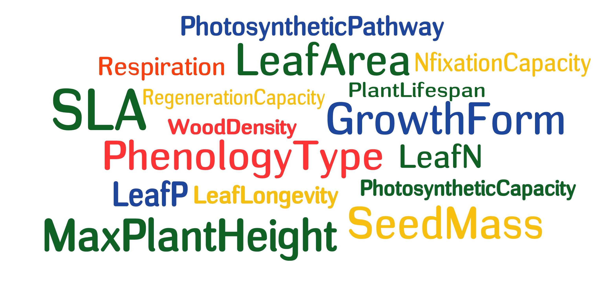

```{r setup, include=FALSE}
options(htmltools.dir.version = FALSE)
knitr::opts_chunk$set(warning = FALSE, message = FALSE, 
  comment = NA, dpi = 300,
  fig.align = "center", out.width = "70%", cache = FALSE)
library(tidyverse)
library(knitr)
```

class:middle, inverse, center

# Andes Biodiversity and Ecosystem Research Group - [ABERG](http://www.andesconservation.org/)

### Using the Andes-Amazon gradient as a laboratory for understanding global change

```{r echo = FALSE}
knitr::include_graphics("img/trocha.jpg")
```
---

# Temas de Interes:
.left-column[

- Ecologia .whisper[Funcional].

- Visualizacion de .whisper[Datos].

- Programacion y manipulacion de .whisper[Datos].
```{r echo=FALSE}
plot(iris)
```

]
.right-column[
```{r echo=FALSE}

 iris %>%
   ggplot(aes(Sepal.Length, color = Species)) + 
   geom_density()+
   theme_bw()+
   theme(legend.position = c(.9,.9),
         legend.background = element_blank())
```
]

---
class: center, middle, inverse

# `r emo::ji("leaf")`

> ## Muchos problemas a los que se enfrentan la sociedad y el medio ambiente necesitan que los ecólogos utilicen volúmenes cada vez más grandes de datos, así como el desarrollo de enfoques que faciliten el uso de dichos datos....

[Cheruvelil K. & Soranno P. 2018](https://academic.oup.com/bioscience/article/68/10/813/5088531)

---
class: center, middle, inverse

# Climate Data Challenges in the 21st Century

.left-column[
## Resalta la necesidad de un nuevo enfoque para el manejo de la información.

[Climate Data Challenges in the 21st Century](http://science.sciencemag.org/content/331/6018/700)

]
.right-column[
```{r echo=FALSE}
include_graphics("img/data_challenge.png")
```
]

---
# Biodiversidad

**Global Biodiversity Information Facility** [CBIF](https://www.gbif.org/)

.left-column[
```{r echo=FALSE}
include_graphics("img/logo_gbif.png")
```


 **Es una red internacional, busca proporcionar a cualquier persona, en cualquier lugar, acceso abierto a datos sobre todos los organismos vivos de la Tierra.**
]
.right-column[
```{r echo=FALSE}
include_graphics("img/biodiversity.png")
```
]
---
class: center, middle, inverse

## **GBIF - Perú**

```{r echo=FALSE}
include_graphics("img/peru_gbif.png")
```
---
class:center, middle, inverse

### Global Plant Trait Database 
 


```{r echo=FALSE}
include_graphics("img/tryperf.jpg")
```
[www.try-db.org](https://www.try-db.org)
---
class: center, middle, inverse
#`r emo::ji("question")`

> # .shout[Tenemos las habilidades para colectar más datos?]

---
class: center, middle, inverse

#`r emo::ji("wood")`

.left-column[
```{r echo=FALSE}
include_graphics("img/leafspectra.jpg")
```

```{r echo=FALSE}
include_graphics("img/book4.jpg")
```
]
.right-column[
```{r echo=FALSE}
include_graphics("img/book3.jpg")
```

```{r echo=FALSE}
include_graphics("img/efrali.jpg")
```
]

---
class: center, middle, inverse

#`r emo::ji("notebook")`

> # .whisper[Sabemos cómo manejar esta información?]

---
class: center, middle, inverse

# .whisper[NO!]

# .whisper[Destinamos tiempo a pensar como colectar información, pero a no al como administrala.]

