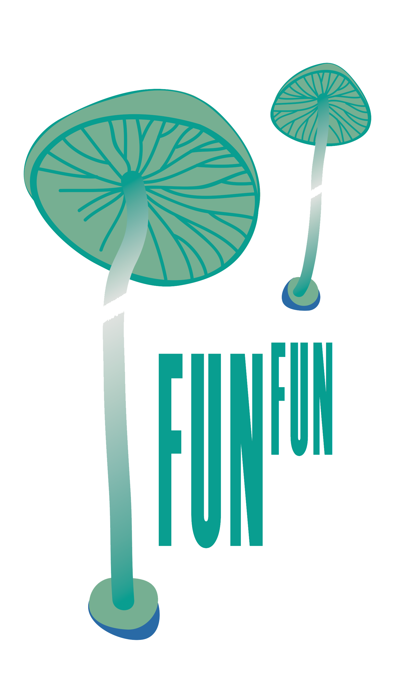

```{r setup, include=FALSE}
options(htmltools.dir.version = FALSE)
knitr::opts_chunk$set(warning = FALSE, message = FALSE, 
  comment = NA, dpi = 300,
  fig.align = "center", out.width = "70%", cache = FALSE)
library(tidyverse)
library(knitr)
```

class:middle, inverse, center

## Andes Biodiversity and Ecosystem Research Group - [ABERG](http://www.andesconservation.org/)

> Using the Andes to Amazon gradient as a laboratory for understanding global change.

```{r echo = FALSE}
knitr::include_graphics("img/trocha.jpg")
```
---
# Temas de Interes:

.left-column[

- Ecologia .whisper[Funcional].

- Visualizacion de .whisper[Datos].

- Programacion y manipulacion de .whisper[Datos].
```{r echo=FALSE}
plot(iris)
```

]
.right-column[
```{r echo=FALSE}

 iris %>%
   ggplot(aes(Sepal.Length, color = Species)) + 
   geom_density()+
   theme_bw()+
   theme(legend.position = c(.9,.9),
         legend.background = element_blank())
```
]

---
class: center, middle, inverse

# `r emo::ji("leaf")`

> ## Muchos problemas a los que se enfrentan la sociedad y el medio ambiente necesitan que los ecólogos utilicen volúmenes cada vez más grandes de datos, así como el desarrollo de enfoques que faciliten el uso de dichos datos....

[Cheruvelil K. & Soranno P. 2018](https://academic.oup.com/bioscience/article/68/10/813/5088531)

---
class: center, middle, inverse

## Datos y Cambio climático. El reto del futuro.

.left-column[
## Un nuevo enfoque para el manejo de la información.

[Climate Data Challenges in the 21st Century](http://science.sciencemag.org/content/331/6018/700)

]
.right-column[
```{r echo=FALSE, out.height=450, out.width=600}
include_graphics("img/data_challenge.png")
```
]

---
class: center, middle, inverse
# Biodiversidad


.left-column[
```{r echo=FALSE}

```


### Acceso abierto a datos de ocurrencia de los organismos vivos.
 
**Global Biodiversity Information Facility** [CBIF](https://www.gbif.org/)

]

.right-column[
```{r echo=FALSE, out.height=450, out.width=600}

```
]
---
class: center, middle, inverse

## **GBIF - Perú**

```{r echo=FALSE, out.height = 400, out.width=350}

```
---
class:center, middle, inverse

### Global Plant Trait Database 
 


```{r echo=FALSE, out.height=450, out.width=600}

```
[www.try-db.org](https://www.try-db.org)
---
class: center, middle, inverse
#`r emo::ji("question")`

> # .shout[Tenemos las habilidades necesarias para colectar más datos?]

---
class: center, middle, inverse

#`r emo::ji("wood")`

.pull-left[
```{r echo=FALSE, out.height=400, out.width=450}
include_graphics("img/leafspectra.jpg")
```

]
.pull-right[

```{r echo=FALSE, out.height=400, out.width=450}
include_graphics("img/efrali.jpg")
```
]

---
class: center, middle, inverse

#`r emo::ji("question")`

> # .whisper[Sabemos cómo manejar esta información?]

---
class: center, middle, inverse

#`r emo::ji("document")`

```{r echo=FALSE, out.height=450}

```
---
class: center, middle, inverse

```{r echo=FALSE, out.height = 450}

```

#`r emo::ji("fear")`


---
class: center, middle, inverse

#`r emo::ji("notebook")`

```{r echo=FALSE}
include_graphics("img/book3.jpg")
```

---
class: center, middle, inverse

# .shout[NO!] `r emo::ji("scream")`

> # .whisper["Destinamos tiempo para colectar información, pero no al como administrala.]


---


.pull-left[
 
## Excel
 
```{r echo=FALSE, out.height= 350, out.width=350}
include_graphics("img/excel_logo.png")
```

]
.pull-right[

## Formato libre

```{r echo=FALSE, out.height=350, out.width=350}
include_graphics("img/cvs.png")
```
]


---
class: center, middle, inverse
#`r emo::ji("tool")`

> ## Utilizamos las herramientas que conocemos, no las que necesitamos.

---
class: center, middle, inverse

## Nuestros errores.

### Excel

> ## "Pensamos en este como un cuaderno de campo y no como una forma de registrar datos para la posteridad, para futuras aplicaciones."

### .shout[Christie Bahlai]

---
class: center, middle, inverse

```{r, echo=FALSE, out.height= 500, out.width=700}

```

---
class: center, middle, inverse

# Data Science 

### Ciencia de Datos

#`r emo::ji("question")`
---
class: center, middle, inverse

### Data Science - Ciencia de Datos

> ## "Es una disciplina emocionante que nos permite generar conocimiento tomando como base los datos sin procesar"

### [Hadley Wickham & Garrett Grolemund](https://r4ds.had.co.nz)

---
class: center, middle, inverse

### Data Science - Ciencia de Datos

> ## "La capacidad de utilizar los  datos .shout[(poder entenderlos, procesarlos, extraer información de ellos, visualizarlos, comunicarlos)] será una habilidad muy importante en las próximas décadas".

[www.mckinsey.com/industries/high-tech/our-insights/hal-varian-on-how-the-web-challenges-managers.](https://www.mckinsey.com/industries/high-tech/our-insights/hal-varian-on-how-the-web-challenges-managers.)
---


```{r echo=FALSE, out.height=500, out.width=500}

```
[https://twitter.com/drob/status/987436677026254848](https://twitter.com/drob/status/987436677026254848)

---
class: center, middle, inverse

# Tidy Data
```{r echo=FALSE, out.width=550, out.height=350}

```


[Hadley Wickham, 2014](file:///C:/Users/Paul%20Efren/Downloads/v59i10.pdf)

---
class: center, middle, inverse

## How to Share Data for Collaboration

```{r echo = FALSE, out.height=350, out.width=600}

```

[Shannon E. Ellis & Jeffrey T. Leek](https://peerj.com/preprints/3139/)
---
class: center, middle, inverse

## Data Organization in Spreadsheets

```{r echo=FALSE, out.height=350, out.width=600}

```


[Karl W. Broman & Kara H. Woo, 2018](https://www.tandfonline.com/doi/abs/10.1080/00031305.2017.1375989)


---
class: center, middle, inverse


### Cada .shout[columna] una .whisper[variable].
### Cada .shout[fila] una .whisper[obserbación].
### Cada .shout[celda] un unico .whisper[valor].

```{r echo=FALSE, out.height= 350, out.width= 600}
include_graphics("img/tidy-1.png")
```
---
class: center, middle, inverse

## .shout[Open Tools]

> ###  Son herramientas de software que están disponibles gratuitamente sin una licencia comercial.
  
  ## `r emo::ji("screen")`

---

```{r echo=FALSE, out.height=200, out.width=350}
include_graphics("img/rlogo.png")
```

```{r echo=FALSE, out.height=250, out.width=450}
include_graphics("img/rstudio.png")
```

### [R](https://cran.r-project.org/) and [RStudio](https://www.rstudio.com/)

---

```{r echo=FALSE, out.height=500, out.width=500}
include_graphics("img/package.png")
```
---

```{r echo=FALSE, out.height=200, out.width=450}

include_graphics("img/python.png")
```

```{r echo=FALSE, out.height=300, out.width=350}

include_graphics("img/jupyter.png")
```


### [Python](https://www.python.org/) and [Jupyter Notebook](http://jupyter.org/)

---
## .whisper[Git] - .whisper[GitHub] - .whisper[Bitbucket]

```{r echo=FALSE}


```

```{r echo=FALSE}

```
---

## .shout[Fungal Trait]

.pull-left[
### .whisper[Genes y Química]
### .whisper[Micorrizas]
### .whisper[Patógenos]
### .whisper[Taxonomía]
### .whisper[3591 spp.]
]
.pull-right[

```{r echo=FALSE}

```
]
---
class: center, middle, inverse

### .shout[PHYLACINE]: The Phylogenetic Atlas of Mammal Macroecology

.pull-left[
### .whisper[IUCN]
### .whisper[Rangos]
### .whisper[Filogenia]
### .whisper[Endemismos]
### .whisper[Peso - Dieta]
]
.pull-right[

```{r echo=FALSE}

```
]

---
class: center, middle, inverse

### .shout[COMPADRE(3.2.1)] - .shout[COMADRE(1.0.0)]:

.whisper[Plant and Animal Matrix Data base]

.whisper[Matrices espaciales.]-.whisper[Demografia.]-.whisper[Historia evolutiva.]


```{r echo=FALSE, out.height=450, out.width=600}

```

---
class: center, middle, inverse

## .shout[TRY: Plant Trait Database]

# `r emo::ji("leaf")`

> ### Características morfológicas, fisiológicas y fenológicas de las plantas.

```{r echo=FALSE}
include_graphics("img/try.png")
```

[www.try-db.org](https://www.try-db.org/)

---
class: center, middle, inverse

### .shout[TRY: Plant Trait Database]

```{r echo=FALSE, out.height=450, out.width=800}

```

---
class: center, middle, inverse

## .shout[FRED: Fine-Root Ecology Database]

```{r echo=FALSE, out.height=450, out.width=700}

```

[FRED](https://roots.ornl.gov/)

---
class: center, middle, inverse

### .shout[FRED: Fine-Root Ecology Database]

```{r echo=FALSE, out.height=450, out.width=700}
include_graphics("img/fred_map.png")
```

---

```{r echo=FALSE}

```

```{r echo=FALSE, out.height=450, out.width=700}

```
---
### Riqueza de especies
.pull-left[
Angiospermas
```{r echo=FALSE, out.height=450, out.width=700}

```
]

.pull-right[
Gimnospermas
```{r echo=FALSE, out.height=450, out.width=700}

```
]
---

### Riqueza de especies
```{r echo=FALSE, out.height=450, out.width=800}

```
---
.whisper[Simova I. et.al, 2018]

```{r echo=FALSE, out.height=500, out.width=600}

```
---
## [Open Traits](http://opentraits.org/)

```{r echo=FALSE, out.height=450, out.width=450}

```

---
## Open Traits - Objetivos
 
> ### 1. Desarrollo de bases de datos estandarizadas.
--

> ### 2. Desarrollar herramientas y técnicas de código abierto para recopilar, limpiar, curar y analizar datos.
--

> ### 3. Desarrollar métodos para la priorización del muestreo.
--

> ### 4. Fomentar la colaboración entre los investigadores.
---
## Plant O Matic: A	dynamic	and	mobile	field	guide to	all	plants	of	the	Americas
.pull- left[
 Greg Goldsmith
```{r echo=FALSE, out.height=450, out.width=450}

```
]
.pull-right[
```{r echo=FALSE, out.height=450, out.width=450}

```
]

Goldsmith	et	al.	(2016)	Methods	in	Ecology	and	Evolution
---
class: center, middle, inverse

## [Global Tree Search](http://www.bgci.org/global_tree_search.php?sec=globaltreesearch)

```{r echo=FALSE, out.height=450, out.width=450}

```

---
class: center, middle, inverse

## [DRYAD](https://datadryad.org/)

```{r echo=FALSE}

```